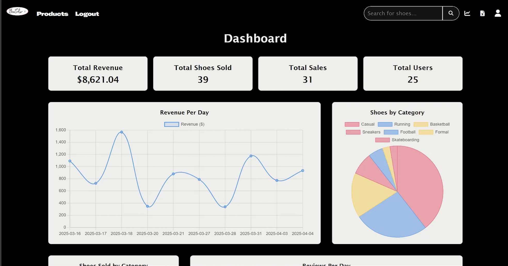
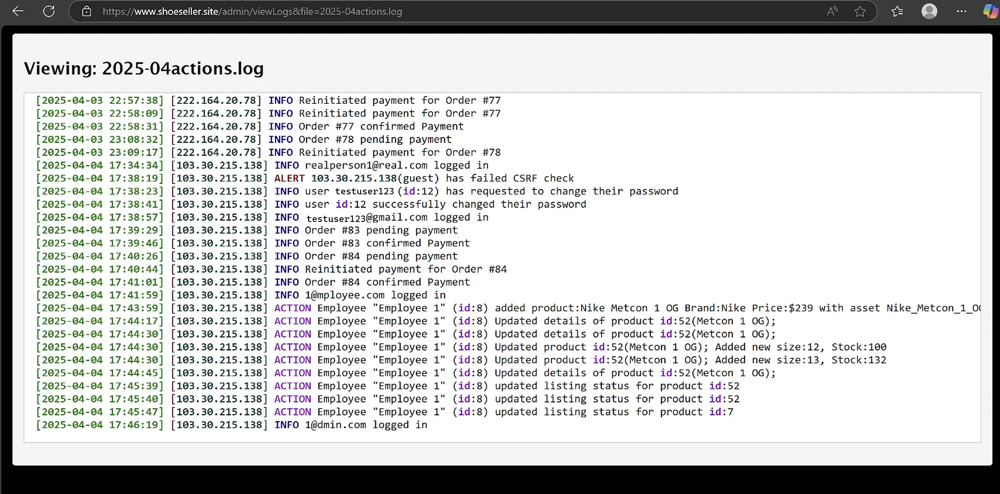
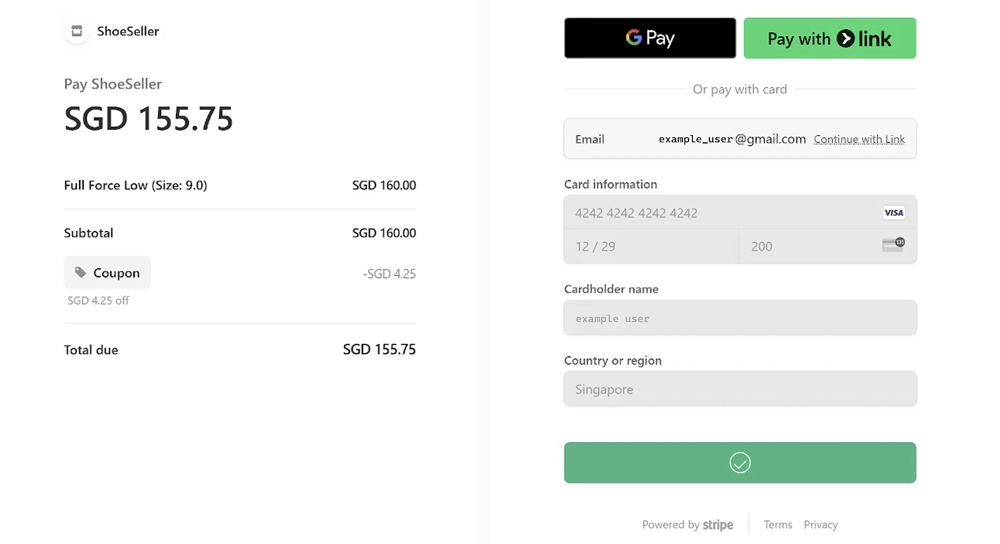
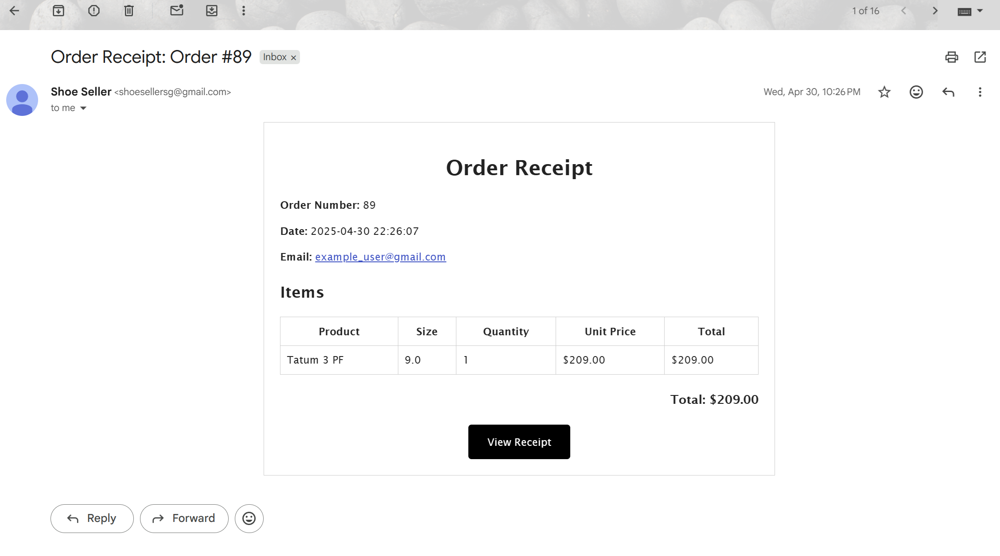

<p align="center">
  
</p>

# ShoeSeller
```plaintext  
███████╗██╗  ██╗ ██████╗ ███████╗███████╗███████╗██╗     ██╗     ███████╗██████╗ 
██╔════╝██║  ██║██╔═══██╗██╔════╝██╔════╝██╔════╝██║     ██║     ██╔════╝██╔══██╗
███████╗███████║██║   ██║█████╗  ███████╗█████╗  ██║     ██║     █████╗  ██████╔╝
╚════██║██╔══██║██║   ██║██╔══╝  ╚════██║██╔══╝  ██║     ██║     ██╔══╝  ██╔══██╗
███████║██║  ██║╚██████╔╝███████╗███████║███████╗███████╗███████╗███████╗██║  ██║
╚══════╝╚═╝  ╚═╝ ╚═════╝ ╚══════╝╚══════╝╚══════╝╚══════╝╚══════╝╚══════╝╚═╝  ╚═╝                                                                                                                                                                  
```
[ShoeSeller](https://www.shoeseller.site) is a specialized e-commerce platform for footwear created for [Singapore Institute of Technology](https://www.singaporetech.edu.sg/)'s INF1005 Module, offering a seamless and secure online shopping experience. Designed using an MVC architecture, the website supports multiple user roles; including admin, employee, and regular user, while providing robust features like secure checkout, a rewards system, and a comprehensive order history.

## Table of Contents

- [Features](#features)
- [System Design & Architecture](#system-design--architecture)
- [Technologies Used](#technologies-used)
- [Installation & Setup](#installation--setup)
- [Configuration](#configuration)
- [Usage](#usage)
- [Security](#security)
- [Contributing](#contributing)
- [Code of Conduct](#code-of-conduct)
- [Security Policy](#security-policy)
- [License](#license)
- [Acknowledgments](#acknowledgments)

## Features

- **Product Catalog:** Browse a wide variety of footwear with detailed descriptions, images, and sizing information.
- **Shopping Cart & Secure Checkout:** Add products to a cart, manage quantities, and check out using Stripe for secure payments.
- **Role-Based Access:**  
  - **Admin:** Full control over product management, order processing, user management, and reporting.  
  - **Employee:** Manage orders and update product listings with restricted privileges.  
  - **User:** Seamless shopping experience, review submissions, order history, and account management.
- **Rewards & Discounts:** Earn points (1 point per $1 spent) and redeem them for discounts (1 point = 1 cent discount) on future orders.
- **Order History & Re‑Checkout:** Users can view a history of their purchases and re-initiate payment for pending orders.
- **User Reviews & Ratings:** Authenticated users can post reviews and rate products to help other customers make informed decisions.
- **Secure Authentication & Session Management:** Includes “Remember Me” functionality with a database-backed token system and periodic session regeneration.
- **Responsive Design:** A fully responsive layout that works across desktops, tablets, and mobile devices.
- **Additional Features:**  
  - Secure password reset functionality with email notifications using PHPMailer.
  - Comprehensive logging of administrative actions.

## Screenshots

- Homepage preview (GIF):  
  
- Admin dashboard preview:  
  
- Audit trail for staff actions:  
  
- Stripe payment integration:  
  
- Email receipt (SMTP):  
  

## System Design & Architecture

ShoeSeller is built using a Model-View-Controller (MVC) design pattern:
- **Model:** Contains data and business logic (e.g., User, Product, Order, Cart, RememberToken).
- **View:** HTML templates enhanced with CSS and JavaScript to present a responsive and user-friendly interface.
- **Controller:** Handles user requests, coordinates data processing via the models, and renders the appropriate views.

## Technologies Used

- **Frontend:** HTML5, CSS3, JavaScript
- **Backend:** [PHP](https://www.php.net/) (following the MVC pattern)
- **Database:** [MySQL](https://www.mysql.com/)
- **Payment Processing:** [Stripe](https://stripe.com/en-sg)
- **Email Notifications:** [PHPMailer](https://github.com/PHPMailer/PHPMailer) with [Gmail](https://mail.google.com/) SMTP
- **Logging:** Custom logging functions (with file-based logs)
- **Development Environment:** [Apache2](https://httpd.apache.org/)
- **Version Control:** Git & GitHub

Below is the File Structure of the project
```
├── app/
│   ├── controllers/
│   ├── models/
│   └── views/
├── config/
├── core/
├── log/
├── public/
│   ├── assets/
│   ├── error/
│   ├── products/
│   └── index.php
├── routes/
├── .env
└── .htaccess
```
 - `App/` contains MVC
   - `Models/` where database connections are managed 
   - `Views/` where the web views are located
   - `Controllers/` where the routing and business login is contained
 - `config/` where the base database connection is (Models inherit from this base connection)
 - `core/` where the core of the website is held, eg: Base classes like `Model` & `Controller` as well as `CORs` policy are held
 - `log/` contains log files 
 - `public/` This is the entry point for the user
   - `assets\` where the `css`, `js` and `images` that are used by the website are held
   - `error\` where the error documents are held (`403`, `404`, `500`)
   -  `products\` is where all products images are held
   - `index.php` This is the entry point as well as the centralised controller for the website
- `routes\` where the routes to the controllers are held
- `.env` the web server's configuration; where the secret keys are held
- `.htaccess` the apache server's ruleset for this domain, ensures all traffic goes to `public\` and defines various security related apache behaviours


## Installation & Setup

1. **Clone the Repository:**

   ```bash
   git clone https://github.com/YourUsername/ShoeSeller.git
   cd ShoeSeller
   ```

2. Database Setup:

Create a new database (e.g., `shoeseller`) in MySQL.

Import the provided SQL schema located in the `database/` folder.

3. Environment Variables:

Create a `.env` file in the project root with your configuration:
  ```dotenv
  DB_HOST=localhost
  DB_NAME=dbname
  DB_USER=root
  DB_PASS=database_Password
  DOMAIN=www.shoeseller.site
  PROTOCOL=https
  STRIPE_SECRET_KEY=sk_live_secretkeystring
  STRIPE_PUBLISHABLE_KEY=pk_live_publickeystring
  EMAIL=shoesellersg@gmail.com
  EMAIL_APP_PASSWORD="secret app password"
  GOOGLE_CAPTCHA_SECRET_KEY="google captcha secret key"
  GOOGLE_CAPTCHA_SITE_KEY="google captcha site key"
  ```

4. Install Dependencies:

Ensure you have [Composer](https://getcomposer.org/) installed, then run:
  ```bash
  composer install 
  ```


5. Configure Apache:

Point your Apache document root to the public/ folder.
Enable mod_rewrite for clean URLs.
Enable `gd` in `php.ini`

## Configuration
Database Connection:
Configure your connection settings `.env`

Session & Security Settings:
Update your PHP configuration (e.g., in `php.ini`) to enforce secure sessions (e.g., `session.use_only_cookies`, `session.cookie_secure`, etc.).

CORS & HTTPS:
Ensure the application is served exclusively over HTTPS and configure any necessary CORS settings.

## Usage
Homepage:
- Browse products and view detailed product pages.

User Authentication:

- Login/Logout: Secure login with “Remember Me” functionality.

- Registration: Create an account to access personalized features.

- Profile Management: Update profile details and upload a profile picture.

- Shopping & Orders:

- Add items to your cart.

- Use the rewards system to redeem points for discounts.

- Complete orders via a secure checkout process integrated with Stripe.

- View order history and reinitiate payment for pending orders.

Admin & Employee Dashboard:
- Manage products, orders, and users through dedicated administrative interfaces.

## Security
- CSRF Protection:
All forms include CSRF tokens.

- Session Management:
Sessions are regenerated on login and periodically during user activity.

- Input Sanitization:
All user inputs are sanitized to prevent XSS and SQL injection.

- Remember Me:
A secure, database-backed token system ensures persistent logins.

- HTTPS:
The application is designed to work exclusively over HTTPS, with cookies set as Secure and HttpOnly.
For more details, see [SECURITY.md](SECURITY.md).

## Contributing
### Main Contributors
1. [AikKai](https://github.com/EggKai)
2. [Nathyn](https://github.com/Nate-0003)
3. [Azim](https://github.com/azim-git)
4. [Teck Seng](https://github.com/teckseng)
5. [Shun Ren](https://github.com/shun-ren)

We welcome contributions to ShoeSeller! Please review our Contributing Guidelines before submitting pull requests or opening issues.

## Code of Conduct
All contributors are expected to abide by our [Code of Conduct](CODE_OF_CONDUCT.md).

## Security Policy
For detailed security practices and vulnerability reporting, please see our [Security Policy](SECURITY.md).

## License
This project is licensed under the MIT License. See the [LICENSE](LICENSE) file for details.

## Acknowledgments
1. [PHPMailer](https://github.com/PHPMailer/PHPMailer)
2. [Stripe PHP](https://github.com/stripe/stripe-php)
2. [Picqer Barcode Generator](https://github.com/picqer/php-barcode-generator)

Special thanks to the open-source community for providing the tools and libraries that made this project possible.
 - If you've made it this far, click the link: https://www.shoeseller.site

### For any questions or support, please contact [shoesellersg@gmail.com](shoesellersg@gmail.com).
